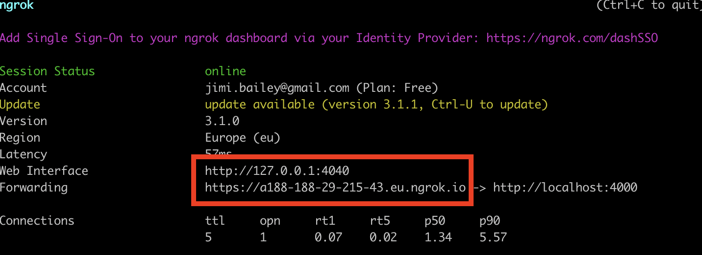

# Phoenix Screen

The Phoenix Screen can run webapps and provides local websockets to expose information from connected hardware. The most common example of this is the ZED-2 Camera

https://www.stereolabs.com/zed-2/

A local service on the Phoenix Screen player provides a websocket that relays the skeleton information from the Zed-2 camera, this runs on port 8080.

A webapp, even if running on HTTPS, can connect to this locally hosted websocket.

## ThreeJS Skeleton Tracking Demo

This demo provides a basic ThreeJS webapp that connects to the Zed 2 Websocket and displays the skeleton information. For the sake of legibility this code has been broken down into modules which is supported by modern browsers.

## Installation

The demo provides a mock Zed 2 Websocket service, which has a dependency on Node.

https://nodejs.org/en/

Once installed install all project dependencies by running the command:

```
npm install
```

The package.json provides some useful 'scripts' to help run this project.

## Run Skeleton Data Service (motion)

```
npm run motion
```

By default this will run the "full-1" data file, but there are other samples available in *motion/data*.

```
npm run motion -- full-2
npm run motion -- part1
npm run motion -- part2
...
npm run motion -- part7
```

## Run the local webapp with live-server

It is possible to open the webapp by directly opening the *index.html* in a browser, but this is discouraged as it is slow and cumbersome. We recommend using something like '**live-server**' since it will auto reload when changes are detected.

```
npm run webapp
```

## Run on the Phoenix Screen in real-time

We use a service like NGROK to expose our local webapp to remote sessions. When used in combination with live-server it allows you to preview and configure your webapp in real-time. It is a free service for individual developers which generates a random url each time the utility is launched, for the paid service you can run multiple sessions and reserve a specific *.ngrok subdomain.

https://ngrok.com/

Once installed run the following command to expose the local webapp to external requests.

```
npm run remote
```

**NOTE:** Run this in addition to "npm run webapp"

This will output a temporary live url that can access the local webapp. Using the Phoenix Screen triggers you can launch an instance of the "WebApp" template and pass the live url.



## Demo Overview

The webapp initialises a basic ThreeJS scene, most of the initial code was lifted from https://threejs.org/docs/#manual/en/introduction/Creating-a-scene

Orbit controls and a window resize listener have been added to make development easier.

Code has been commented to explain the purpose of most functions. 

A websocket is initialised at the end of the script, and this is responsble for managing and posing the skeletons.

```
createWs(
    `ws://${wsDomain}:${wsPort}`,
    {
        onOpen : () => {
            console.log('ws:open');
        },
        onError : ( err ) => {
            console.log('ws:error',err);
        },
        onClose : () => {
            console.log('ws:close');
        },
        onMessage : ( data ) => {

        }
    }
);
```

As an advanced feature of the Phoenix Screen's CMS, the wsDomain and wsPort are configurable parameters that could be set externally. In this instance wsDomain and wsPort are unlikely to change, but provide an example of how to use the utility '*parseQueryString*'.

## Configuring the world scale

There are a number of methods that have been provided to help manage the real world skeleton data coordinates.

### A root container

A root container that can be scaled and respositioned has been provided, instead of adding children directly to the scene.

### Basic transforms

The following variables will reposition and rescale any spacial coordinates when used in conjunction with the method 'applyTransform'.

```
// SCALES DOWN ALL JOINTS POSITIONS
const SCALE_JOINTS = new THREE.Vector3(.1,.1,.1);
// OFFSETS THE ROOT POSITION OF THE SKELETON
const ORIGIN_BODY = new THREE.Vector3(0,20,0);
// SCALES DOWN THE ROOT POSITION OF THE SKELETON
// NOTE: this example limits the motion in the y and z axis, limits some up down and back/forth movement 
const SCALE_BODY = new THREE.Vector3(.1,.5,.1);
```

These are not 'best-practice', but provide a rudimentary technique to quickly and test and calibrate the code to the screen.

**NOTE:** The skeleton data provided is from a secondary installation. At some point data from the Phoenix Player will be extracted and added to the repository so that the motion data can be used as a more reliable approximation of live conditions.

